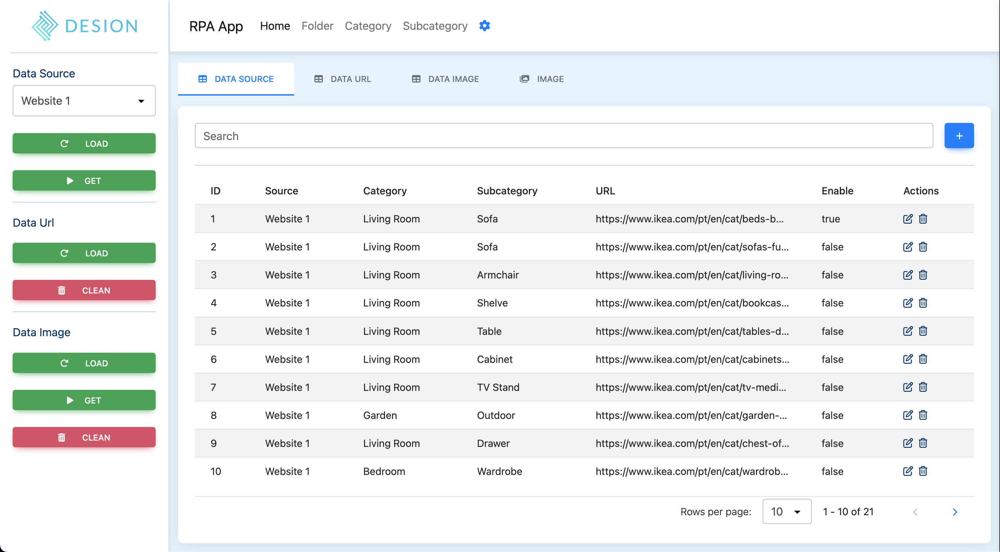
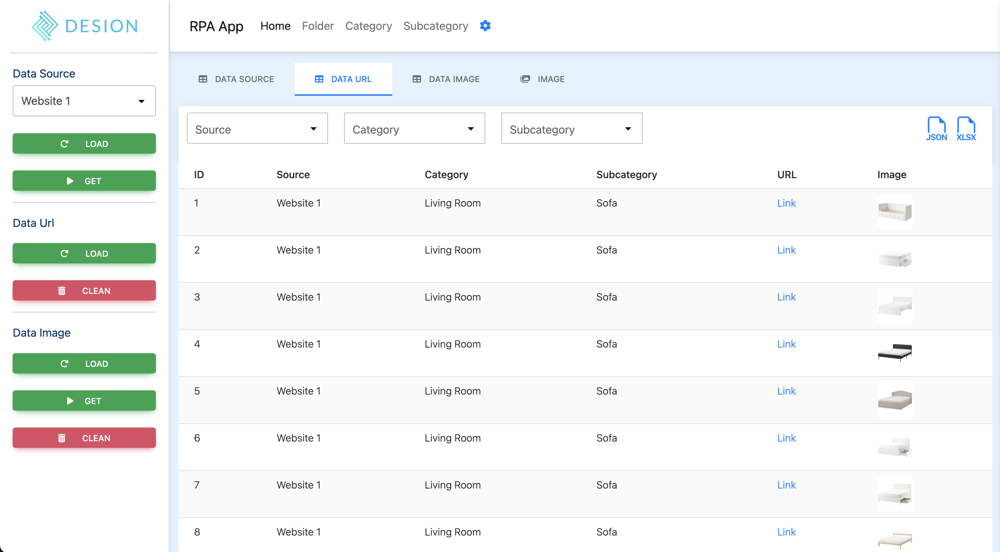
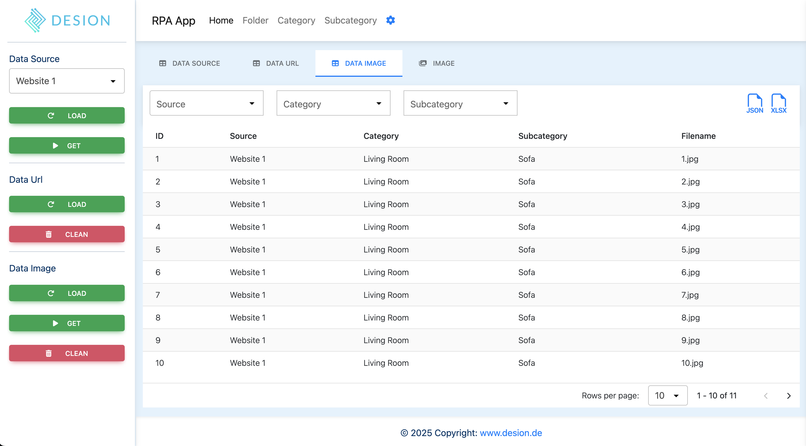
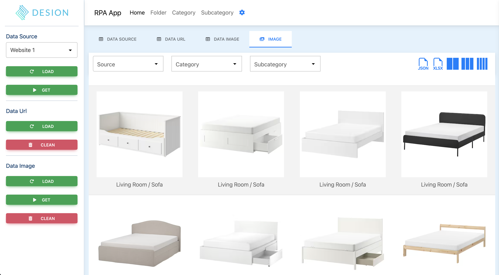

# Exploring and Understanding the Use of RPA in Enterprise Systems

This repository contains the implementation and demonstration code developed as part of the Master’s thesis **“Exploring and Understanding the Use of Robotic Process Automation (RPA) in Enterprise Systems”**, completed in 2025 by **Cezar**.  

The project investigates how RPA can be customized and integrated into enterprise systems to improve efficiency, scalability, and return on investment.  

---

## 📖 Overview

Robotic Process Automation (RPA) allows organizations to automate repetitive and rule-based tasks by using software robots that emulate human interactions.  
In this project, an **Action Research methodology** was applied in collaboration with **Desion GmbH**, a German company specialized in AI and computer vision, to automate the acquisition of high-quality image datasets for training machine learning models.  

The solution was developed using **Puppeteer**, a Node.js library for browser automation.  

---

## 🚀 Features

- Automated navigation across multiple websites  
- Extraction of product images and metadata (e.g., furniture descriptions)  
- Robust scraping with flexible selectors  
- Storage of collected images and structured data  
- Significant improvements in efficiency, error reduction, and scalability  

---

## 📊 Results

- **Cycle time reduction:** from 180s to 5s per image (97% faster)  
- **Error rate reduction:** from 12.5% to 2.8%  
- **Throughput:** from 100 images/day to 3,600 images/day  
- **Cost savings:** ~62.5% reduction in labor costs  

---

## 🛠️ Technologies

- [Node.js](https://nodejs.org/)  
- [Puppeteer](https://pptr.dev/)  
- [JavaScript/ES6]  
- [Json-Server] (optional for settings)  

---

## 📂 Project Structure

├── src/ # Source code

│ ├── App.js # Main RPA script using Puppeteer

│ ├── package.json # Configuration (URLs, selectors, settings)

│ └── utils/ # Helper functions

├── images/ # Collected images

├── express/ # Metadata

├── docs/ # Thesis documentation & presentation

├── README.md # Project documentation

---

## ⚙️ Installation

1. Clone this repository:
   ```bash
   git clone https://github.com/devrazec/rpa.git
   cd rpa
   npm install


## ⚙️ Start

1. Start this project:
   ```bash
   npm start

## ⚙️ Screenshot

  
  
  
  


⚠️ Legal & Ethical Notice

This code is for research and educational purposes only.

Web scraping may be subject to the terms of service of target websites.

Ensure compliance with GDPR, copyright law, and data usage policies before applying in production.


📌 Future Work

Integration with AI for Intelligent Process Automation (IPA)

Scaling across distributed/cloud environments

Application to other enterprise workflows (procurement, inventory management, etc.)


📜 License

This project is licensed under the MIT License. See LICENSE for details.
